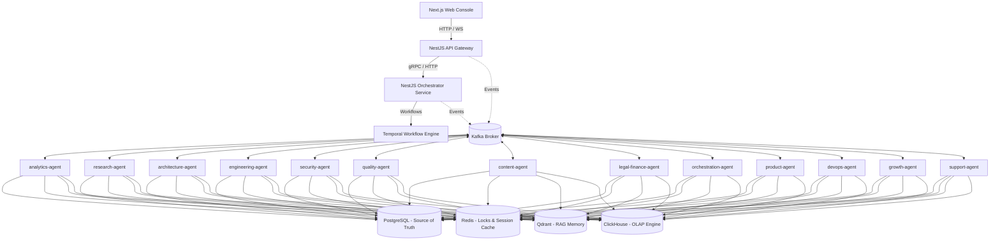

# Vehicle Information Platform (VIP) India - AI Agent Platform Monorepo

Welcome to the production-ready monorepo for the **AI Agent Company platform** running the **Vehicle Information Platform in India**. 

This platform orchestrates 13 specialized AI agents (FastAPI & NestJS) to handle RTO database queries, insurance tracking, architecture generation, legal-financial compliance, code changes, and analytics.

---

## 1. System Architecture



### Infrastructure Layer Roles
* **PostgreSQL (Source of Truth)**: Transactional storage for agent registration, tasks details, workflow metadata, and human approvals.
* **Redis (Cache & State)**: Multi-agent distributed locking, sliding-window rate-limiting, and short-term session conversation context.
* **Qdrant (Vector Knowledge)**: Dense collection storing vectorized legal guidelines, design tokens, and past codebase samples.
* **ClickHouse (OLAP Analytics)**: Real-time tracking of token usage billing, agent performance metrics, system logs, and event streams.
* **Temporal (Durable Workflows)**: State machines orchestrating long-running multi-agent pipelines with automated retries and approval locks.

---

## 2. Getting Started

### Prerequisites
- **Node.js**: >= 20.x
- **PNPM**: >= 9.x
- **Python**: >= 3.12 (with Poetry installed)
- **Docker**: Engine version >= 20.x

### How to Install & Bootstrap
1. Install root JS workspace dependencies:
   ```bash
   pnpm install
   ```
2. Setup Python dependencies (Poetry envs) and configure all directories:
   ```bash
   make bootstrap
   ```

### Running Locally
1. **Start Infrastructure Databases**:
   ```bash
   make infra-up
   ```
2. **Launch API Gateway**:
   ```bash
   make run-gateway
   ```
3. **Launch Orchestrator**:
   ```bash
   make run-orchestrator
   ```
4. **Launch Web Console**:
   ```bash
   make run-console
   ```

---

## 3. Running a Single Agent (e.g. `analytics-agent`)

If you want to debug or run only the `analytics-agent` without spinning up the rest of the fleet:
1. Make sure databases are running:
   ```bash
   make infra-up
   ```
2. Run the helper make target:
   ```bash
   make run-analytics
   ```
3. Or navigate to the folder and run Poetry manually:
   ```bash
   cd agents/analytics-agent
   poetry run uvicorn app.main:app --host 0.0.0.0 --port 8000 --reload
   ```

---

## 4. How to Add a New Agent

### Option A: Adding a Python FastAPI Agent
1. Create a folder under `agents/my-new-agent/`.
2. Follow Clean Architecture domains:
   - `app/main.py` (FastAPI router bindings)
   - `app/config/settings.py` (pydantic-settings bindings)
   - `app/langgraph/graph_builder.py` (state definitions)
   - `app/events/consumer.py` (Kafka topic bindings)
3. Add a `pyproject.toml` and configure dependencies.
4. Add a `Dockerfile`.

### Option B: Adding a NestJS Agent
1. Create a folder under `agents/my-new-nestjs-agent/`.
2. Add a `package.json` specifying `@nestjs/common`, `@nestjs/core`, and microservice controllers.
3. Configure `tsconfig.json` and a standard NestJS bootstrapping structure.
4. Make sure to declare it in the root `pnpm-workspace.yaml`.

---

## 5. Agent Communication & API Routing

### Kafka Event Streaming
Agents speak asynchronously via Kafka event channels. When `product-agent` approves a PRD, it publishes a `product.prd.approved` event. The `architecture-agent` listens to this event, triggers its internal design logic, and publishes `architecture.hld.ready`.

Example event envelope format:
```json
{
  "header": {
    "eventId": "uuid-v4-string",
    "correlationId": "corr-uuid-string",
    "source": "product-agent",
    "timestamp": "2026-06-23T12:00:00Z",
    "version": "1.0.0"
  },
  "payload": {
    "prdId": "prd_delhi_rto_9981",
    "vehicleSegment": "four-wheeler"
  }
}
```

### Gateway Routing
The Next.js frontend calls the central NestJS API Gateway (`apps/api-gateway`). The API Gateway handles authentication and validates RBAC scopes. It then proxies the request to the target microservice/agent or publishes a command event on the Kafka broker to kick off an orchestration task.

---

## 6. Microservices Readiness
Although current deployment runs in a local monorepo config, every agent in the `agents/` folder is designed to be **independently packaged and deployed**.
- Each agent contains its own `Dockerfile` compile-target.
- Each agent references isolated configs via environment parameters.
- Each agent connects to its own independent PostgreSQL schemas, avoiding cross-DB boundaries.
